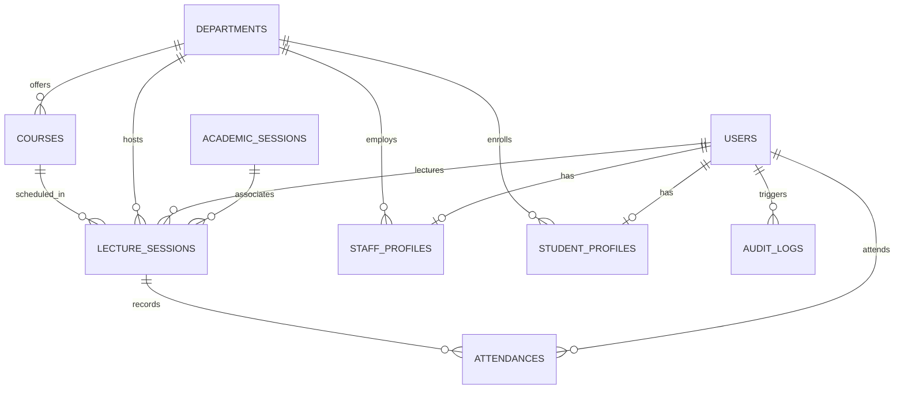
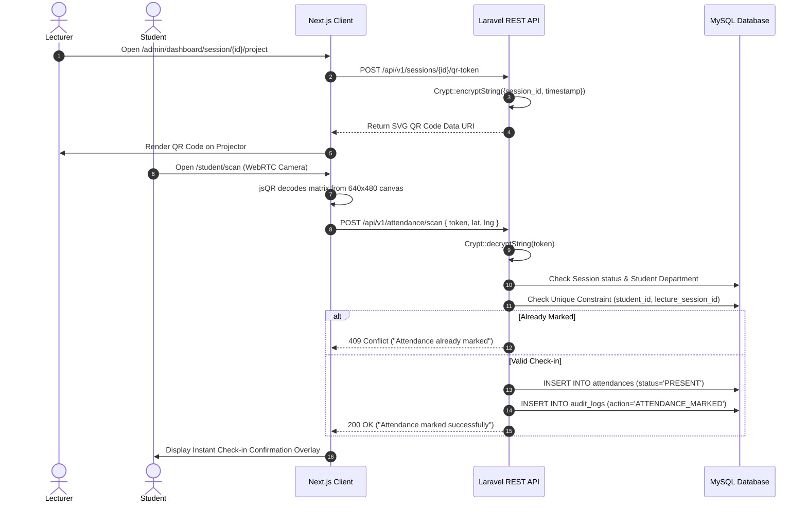

# Attendance Management System

A modern, role-based institutional attendance management and lecture verification platform. The system pairs a high-performance **Next.js (App Router)** client with a secure **Laravel REST API** backend powered by **MySQL**, utilizing encrypted **QR Code verification** and optional geofencing to automate classroom attendance tracking and reporting.

---

## Overview

Traditional manual attendance methods (paper sign-in sheets, roll calls) are slow, prone to proxy attendance ("buddy punching"), and labor-intensive to aggregate. The **Attendance Management System** solves these challenges by providing an automated, tamper-resistant digital attendance workflow:

- **Lecturers / Administrators** schedule lecture sessions and project a cryptographically signed, encrypted dynamic QR Code on classroom screens.
- **Students** scan the projected QR Code directly using their mobile or laptop camera through a WebRTC-powered viewfinder.
- **The System** validates the student's enrollment, session timing, status, active enrollment department, and optionally verifies physical presence within the classroom's geofenced GPS radius before persisting the record.
- **Real-Time Dashboards** provide institutional metrics, daily attendance percentages, enrollment shares, attendance histories, and audit trails across departments and courses.

---

## Key Features

### 🔐 Authentication & Access Control
- **Multi-Role Authorization**: Granular Role-Based Access Control (RBAC) managed via `spatie/laravel-permission` across 5 distinct roles:
  - `Super Administrator`
  - `Administrator`
  - `Head of Department`
  - `Lecturer`
  - `Student`
- **Sanctum Token Authentication**: Stateful API authentication and Bearer token issuance for protected API endpoints.
- **Dedicated Portals**:
  - Administrative Management Portal (`/admin/login` -> `/admin/dashboard`)
  - Student Attendance Portal (`/student/login` -> `/student/dashboard`)
- **Self-Service Student Registration**: Synchronized Zod and Laravel validation rules with auto-assignment of student profile metadata (matriculation number, department, level, gender, phone).
- **Rate-Limited Public Endpoints**: Built-in 60 req/min throttling on authentication routes to prevent brute-force attacks.

### 📷 QR Code Attendance Engine
- **Encrypted Session Payloads**: Session QR tokens are generated and encrypted on the backend using Laravel's `Crypt::encryptString()` (AES-256-CBC) to prevent students from manually forging attendance tokens.
- **Live Camera Viewfinder**: WebRTC-powered camera engine using `jsQR` with support for:
  - Built-in Integrated Laptop Webcams
  - External USB Webcams
  - Virtual & Network Cameras (Iriun Webcam, DroidCam, OBS Virtual Camera)
- **High-Performance Canvas Optimization**: Downscales high-resolution camera feeds to a 640×480 canvas and throttles decoding intervals (~120ms) to ensure smooth scanning without CPU lockup.
- **Dynamic Camera Switching**: Hot-swappable camera device selector with clean `MediaStream` track release and automatic `devicechange` hardware detection.
- **Manual Token Fallback**: Allows students with hardware camera malfunctions to manually submit session verification tokens.

### 🛡️ Attendance Validation & Integrity
- **Anti-Proxy Protection**:
  - **Database-Level Unique Constraints**: `attendances` table enforces a composite unique key `['student_id', 'lecture_session_id']` ensuring no student can mark attendance more than once per session.
  - **Department Scope Matching**: Validates that the student's registered department matches the lecture session's hosting department.
  - **Session Status Verification**: Rejects attendance submissions for inactive or concluded sessions.
  - **Optional GPS Geofencing**: Computes Haversine distance between student coordinates and classroom coordinates against a defined geofence radius (default: 50m).

### 👥 User & Academic Management
- **Department Management**: Complete CRUD operations for institutional departments with soft-deletes, archiving, and code uniqueness validation.
- **Course Management**: Course allocation, credit unit management, semester assignments, and lecturer assignment per course.
- **Staff Profiles**: Academic staff records with staff IDs, academic titles, phone numbers, and department affiliations.
- **Student Profiles**: Matriculation tracking, level progression (100–500 Level), department enrollment, and contact details.
- **Lecture Sessions**: Scheduling of classroom lectures with start/end time windows, venue locations, GPS coordinates, and session states (`ACTIVE`, `COMPLETED`).

### 📊 Dashboard & Reporting
- **Scoped Metrics**: Real-time counter widgets for total staff, departments, courses, and students, dynamically scoped based on user role (Admin sees global metrics; HOD sees departmental metrics; Lecturer sees assigned course metrics).
- **Daily Attendance Breakdown**: Present/Absent counts with dynamic attendance rate calculations.
- **Visual Analytics**:
  - Weekly attendance trends visualization (SVG-based).
  - Departmental and course enrollment share distribution (Donut chart).
- **Attendance History & Live Tracking**: Live session check-in logs with timestamps, device user-agents, and IP records.
- **CSV Data Export**: Streamed CSV export of attendance logs filtered by department, course, and date range.
- **System Audit Logs**: Comprehensive activity logging capturing administrative actions, session creation, logins, and attendance scans.

---

## How It Works

```
┌─────────────────┐        ┌──────────────────┐        ┌───────────────────┐
│ Lecturer / HOD  │        │ Classroom Screen │        │  Student Mobile   │
│  (Admin Portal) │        │  (QR Projection) │        │ (Attendance View) │
└────────┬────────┘        └────────▲─────────┘        └─────────┬─────────┘
         │                          │                            │
         │ 1. Create Session        │                            │
         │ 2. Generate QR Code      │                            │
         ├──────────────────────────┘                            │
         │                                                       │
         │                                   3. Point Camera &   │
         │                                      Scan QR Code     │
         │                                                       ├──────────────────────────┐
         │                                                       │                          │
         ▼                                                       ▼                          ▼
┌───────────────────────────────────────────────────────────────────────────────────────────────┐
│                                   Laravel API Backend                                         │
│                                                                                               │
│ 4. Decrypt Token -> 5. Verify Session -> 6. Check Duplicate -> 7. Validate Geofence (Optional)│
│                                                                                               │
│ 8. Store Record in MySQL (`attendances` table) -> 9. Dispatch Audit Log                       │
└───────────────────────────────────────────────┬───────────────────────────────────────────────┘
                                                │
                                                ▼
                                    ┌───────────────────────┐
                                    │ Live Dashboard Update │
                                    │   (Admin & Student)   │
                                    └───────────────────────┘
```

1. **Session Creation**: The Lecturer/Admin navigates to `/admin/dashboard/session` and creates a lecture session specifying Course, Department, Date, Start Time, End Time, Venue, and optional Geofence parameters.
2. **QR Generation**: The backend generates an encrypted JSON payload containing `{ session_id, timestamp, static }` using AES-256 encryption. The frontend renders this payload as an SVG QR Code on the classroom projector screen (`/admin/dashboard/session/[id]/project`).
3. **Student Scan**: The student logs into `/student/scan` on their device and points their camera at the projected code.
4. **Decryption & Validation**: The backend decrypts the payload, checks that the session is `ACTIVE`, validates student department enrollment, checks for prior attendance records (`HTTP 409 Conflict` if duplicate), and verifies GPS distance if enabled.
5. **Persistence**: The attendance record is saved as `PRESENT` with a timestamp, IP address, and coordinates.
6. **Live Visibility**: The student's dashboard immediately reflects the verified attendance, and the lecturer's live attendance monitor updates.

---

## System Architecture

The application adopts a decoupled frontend-backend architecture:

```
┌────────────────────────────────────────────────────────┐
│                   Next.js 16 Client                    │
│  - React 19 Server & Client Components                 │
│  - TanStack React Query (State Management & Caching)   │
│  - Axios Client with Unified Error Normalizer          │
│  - WebRTC Camera Engine + jsQR Frame Analyzer          │
│  - Tailwind CSS + App Router Intercepting Parallel Modals│
└───────────────────────────┬────────────────────────────┘
                            │
               RESTful HTTP / JSON (Port 8000)
               Authorization: Bearer <Sanctum Token>
                            │
┌───────────────────────────▼────────────────────────────┐
│                  Laravel 12 REST API                   │
│  - Route Prefix: /api/v1 (Throttle: 60 req/min)        │
│  - Laravel Sanctum Authentication Middleware           │
│  - Spatie Laravel-Permission (Role-Based Scoping)      │
│  - Simple QrCode Generator Service                     │
│  - Crypt / Decrypt Verification Service                │
│  - Form Request Validation & Centralized Error Handler │
└───────────────────────────┬────────────────────────────┘
                            │
                     Eloquent ORM / PDO
                            │
┌───────────────────────────▼────────────────────────────┐
│                    MySQL Database                      │
│  - Relational Foreign Keys & Cascading Rules           │
│  - Composite Unique Constraints (Anti-Duplicate)       │
│  - Soft Deletions & Audit Logging                      │
└────────────────────────────────────────────────────────┘
```

---

## Technology Stack

| Layer / Component | Technology | Version | Purpose |
| :--- | :--- | :--- | :--- |
| **Frontend Framework** | [Next.js](https://nextjs.org/) | `16.2.4` | App Router, SSR, Parallel & Intercepting Modals |
| **UI Library** | [React](https://react.dev/) | `19.2.4` | Component-driven user interface |
| **Language (Frontend)** | [TypeScript](https://www.typescriptlang.org/) | `^5.0` | Strict type safety and domain interfaces |
| **State & API Caching** | [TanStack React Query](https://tanstack.com/query) | `^5.101.2` | Client data caching, optimistic updates, and background refetching |
| **HTTP Client** | [Axios](https://axios-http.com/) | `^1.18.1` | REST API communication with centralized error normalizer |
| **QR Code Scanner** | [jsQR](https://github.com/cozmo/jsQR) | `^1.4.0` | Real-time browser canvas video frame QR decoder |
| **Schema Validation** | [Zod](https://zod.dev/) | `^4.4.3` | Client-side form validation matching backend rules |
| **Form Handling** | [React Hook Form](https://react-hook-form.com/) | `^7.82.0` | Performant form state and validation management |
| **Icons & Styling** | [Lucide React](https://lucide.dev/) / [Tailwind CSS](https://tailwindcss.com/) | `^1.14` / `^4.0` | Modern SVG icons and responsive CSS styling |
| **Backend Framework** | [Laravel](https://laravel.com/) | `^12.0` / `^13.8` | RESTful API architecture, controllers, routing, ORM |
| **Language (Backend)** | [PHP](https://www.php.net/) | `^8.3` | Server-side execution environment |
| **API Authentication** | [Laravel Sanctum](https://laravel.com/docs/sanctum) | `^4.0` | API token management and route protection |
| **Role Management** | [Spatie Laravel Permission](https://spatie.be/docs/laravel-permission) | `^8.3` | RBAC roles and permissions management |
| **QR Code Generator** | [Simple Software IO QrCode](https://github.com/SimpleSoftwareIO/simple-qrcode) | `^4.2` | Vector SVG QR Code generation for projection |
| **Database** | [MySQL](https://www.mysql.com/) | `8.0+` | Relational storage, composite indexing, foreign key constraints |

---

## Project Structure

```
attendance/
├── app/                                 # Next.js App Router root
│   ├── (website)/                       # Public-facing routes & Student Portal
│   │   ├── page.tsx                     # Landing Page
│   │   └── student/
│   │       ├── login/page.tsx           # Student Authentication
│   │       ├── register/page.tsx        # Student Registration with Zod Validation
│   │       ├── dashboard/page.tsx       # Student Attendance History & Summary
│   │       └── scan/page.tsx            # Multi-Device WebRTC QR Scanner
│   ├── admin/
│   │   ├── (auth)/login/page.tsx        # Admin & Staff Login Page
│   │   └── dashboard/                   # Protected Administration Dashboard
│   │       ├── page.tsx                 # Analytics & Stats Overview
│   │       ├── layout.tsx               # Dashboard Master Layout (Header + SideNav + Modal Slots)
│   │       ├── @formmodal/              # Parallel Route Intercepting Modal Slot
│   │       ├── attendance/page.tsx      # Global Attendance Verification Logs
│   │       ├── branch/page.tsx          # Institutional Branches / Departments
│   │       ├── course/page.tsx          # Course Management
│   │       ├── department/page.tsx      # Department Management
│   │       ├── report/page.tsx          # Reports & CSV Export
│   │       ├── session/                 # Lecture Session Scheduling
│   │       │   └── [id]/project/page.tsx# Projector Mode Live QR Code Display
│   │       ├── staff/page.tsx           # Staff Management
│   │       └── students/page.tsx        # Student Registry
│   └── layout.tsx                       # Root HTML Layout & Query/Toast Providers
├── components/                          # Reusable Frontend Components
│   ├── api/client.ts                    # Axios Client, Domain Types, React Query API Hooks
│   ├── auth-provider.tsx                # Centralized Authentication & Hydration Context
│   ├── error-boundary.tsx               # Production Error Boundary
│   ├── layout/dashboard/                # Header, Side Navigation, Modals
│   └── ui/                              # InputField, SelectField, Button, Toasts
├── backend/                             # Laravel Backend Application
│   ├── app/
│   │   ├── Http/Controllers/Api/        # REST API Controllers (Auth, Attendance, Sessions, Stats)
│   │   └── Models/                      # Eloquent ORM Models (User, Attendance, LectureSession, etc.)
│   ├── config/                          # Application, CORS, and Sanctum Configs
│   ├── database/
│   │   ├── migrations/                  # Schema Migrations (Foreign Keys, Constraints)
│   │   └── seeders/DatabaseSeeder.php   # Idempotent Database Seeders
│   └── routes/api.php                   # v1 Versioned API Route Definitions
├── public/                              # Static Assets, Logos, and Backgrounds
├── package.json                         # Frontend Dependencies & Scripts
└── README.md                            # Project Documentation
```

---

## Database Design



### Primary Database Entities

| Table | Model | Primary Key | Key Columns | Relationships / Constraints |
| :--- | :--- | :--- | :--- | :--- |
| `academic_sessions` | `AcademicSession` | `id` | `name`, `start_date`, `end_date`, `is_current`, `status` | Unique index on `name`. HasMany `lectureSessions`. Protected deletion when active or linked. |
| `users` | `User` | `id` | `name`, `email`, `password`, `status` | Polymorphic roles via Spatie (`roles`). HasOne `StaffProfile` or `StudentProfile`. |
| `departments` | `Department` | `id` | `name`, `code`, `status` | Unique index on `code`. HasMany `courses`, `studentProfiles`, `staffProfiles`. |
| `courses` | `Course` | `id` | `code`, `name`, `level`, `credit_unit`, `semester`, `department_id`, `lecturer_id` | Foreign keys to `departments` and `users`. Unique index on `code`. |
| `staff_profiles` | `StaffProfile` | `id` | `user_id`, `department_id`, `staff_id`, `title`, `phone`, `gender` | Foreign keys to `users` and `departments`. Unique index on `staff_id`. |
| `student_profiles` | `StudentProfile`| `id` | `user_id`, `department_id`, `matric_number`, `level`, `phone`, `gender` | Foreign keys to `users` and `departments`. Unique index on `matric_number`. |
| `lecture_sessions`| `LectureSession`| `id` | `academic_session_id`, `course_id`, `department_id`, `lecturer_id`, `date`, `start_time`, `end_time`, `location`, `latitude`, `longitude`, `geofence_radius`, `token`, `status` | Foreign keys to `academic_sessions`, `courses`, `departments`, `users`. HasMany `attendances`. |
| `attendances` | `Attendance` | `id` | `student_id`, `lecture_session_id`, `status`, `scanned_at`, `latitude`, `longitude`, `method` | Foreign keys to `users` and `lecture_sessions`. **Composite Unique**: `['student_id', 'lecture_session_id']`. Status: `PRESENT`, `LATE`. |
| `audit_logs` | `AuditLog` | `id` | `user_id`, `action`, `description`, `ip_address`, `user_agent` | Foreign key to `users` (nullable). |

---

## API Architecture

All endpoints are versioned under `/api/v1` and return standardized JSON responses.

### Public Endpoints (Rate-limited: 60 req/min)

| Method | Endpoint | Purpose | Request Body | Response Summary |
| :--- | :--- | :--- | :--- | :--- |
| `POST` | `/api/v1/auth/login` | Authenticate user & issue Bearer token | `{ email, password }` | `{ success: true, token, access_token, user }` |
| `POST` | `/api/v1/auth/student-register` | Public student self-registration | `{ name, email, password, matric_number, department_id, level, phone, gender }` | `{ success: true, message, user }` |
| `POST` | `/api/v1/auth/forgot-password` | Request password reset instructions | `{ email }` | `{ message }` |
| `POST` | `/api/v1/auth/reset-password` | Reset account password | `{ token, email, password, password_confirmation }` | `{ message }` |

### Protected Endpoints (`auth:sanctum`)

| Method | Endpoint | Purpose | Query / Request Body | Response Summary |
| :--- | :--- | :--- | :--- | :--- |
| `GET` | `/api/v1/auth/profile` | Retrieve authenticated user profile | — | `{ user: { id, name, email, role, profile } }` |
| `POST` | `/api/v1/auth/logout` | Revoke active access token | — | `{ message: "Logged out successfully" }` |
| `GET` | `/api/v1/dashboard/stats` | Retrieve scoped metrics & charts | — | `{ counters, today_summary, trends, shares, activities }` |
| `GET` | `/api/v1/academic-sessions` | List institutional academic sessions | `?status=...&page=1` | Paginated Academic Session records |
| `GET` | `/api/v1/academic-sessions/current`| Retrieve currently active academic session | — | Current Academic Session record |
| `POST` | `/api/v1/academic-sessions` | Create academic session (Admin only) | `{ name, start_date, end_date, is_current, status }` | Created Academic Session record |
| `POST` | `/api/v1/academic-sessions/{id}/activate` | Set session as sole active session | — | Activated session record |
| `DELETE`| `/api/v1/academic-sessions/{id}` | Delete session (Safe cascade check) | — | `{ message }` (Protected if sessions exist) |
| `GET` | `/api/v1/departments` | List institutional departments | `?per_page=10&search=...` | Paginated Department records |
| `POST` | `/api/v1/departments` | Create new department | `{ name, code, status }` | Created Department record |
| `GET` | `/api/v1/courses` | List courses | `?department_id=...&level=...` | Paginated Course records |
| `POST` | `/api/v1/courses` | Create course | `{ code, name, department_id, lecturer_id, level, credit_unit, semester }` | Created Course record |
| `GET` | `/api/v1/staff` | List staff members | `?search=...&department_id=...` | Paginated Staff records |
| `POST` | `/api/v1/staff` | Create staff account & profile | `{ name, email, password, staff_id, department_id, title, role, phone, gender }` | Created Staff record |
| `GET` | `/api/v1/students` | List students | `?department_id=...&level=...` | Paginated Student records |
| `POST` | `/api/v1/students` | Create student account & profile | `{ name, email, password, matric_number, department_id, level, phone, gender }` | Created Student record |
| `GET` | `/api/v1/sessions` | List lecture sessions | `?academic_session_id=...&status=...` | Paginated Lecture Sessions |
| `POST` | `/api/v1/sessions` | Schedule new lecture session | `{ academic_session_id, course_id, department_id, lecturer_id, date, start_time, end_time, location, latitude, longitude, geofence_radius }` | Created Session record |
| `POST` | `/api/v1/sessions/{id}/qr-token` | Generate fresh encrypted QR token | — | `{ session_id, token, qr_code_url }` |
| `POST` | `/api/v1/sessions/{id}/end` | Conclude lecture session | — | `{ message, session }` |
| `POST` | `/api/v1/attendance/scan` | Verify QR token & mark attendance | `{ token, latitude?, longitude? }` | `{ success: true, message: "Attendance marked PRESENT/LATE...", attendance }` |
| `GET` | `/api/v1/attendance/history` | Scoped attendance records history | `?academic_session_id=...&per_page=15` | Attendance log history |
| `GET` | `/api/v1/attendance/export` | Stream CSV export of attendance | `?academic_session_id=...&course_id=...` | CSV File Stream |

---

## Installation

### Prerequisites
- **PHP**: `^8.3` (with `pdo_mysql`, `openssl`, `mbstring`, `bcmath`, `curl` extensions enabled)
- **Composer**: `2.x`
- **Node.js**: `18.x` or `20.x+`
- **MySQL**: `8.0+`

---

### Backend Setup (Laravel)

1. Open a terminal and navigate to the backend directory:
   ```bash
   cd backend
   ```

2. Install PHP dependencies via Composer:
   ```bash
   composer install
   ```

3. Configure the environment file:
   ```bash
   cp .env.example .env
   ```

4. Configure your MySQL database credentials in `backend/.env`:
   ```env
   DB_CONNECTION=mysql
   DB_HOST=127.0.0.1
   DB_PORT=3306
   DB_DATABASE=attendance_db
   DB_USERNAME=root
   DB_PASSWORD=your_password
   ```

5. Generate the application encryption key:
   ```bash
   php artisan key:generate
   ```

6. Run migrations and seed default administrative accounts:
   ```bash
   php artisan migrate --seed
   ```

7. Start the Laravel development server:
   ```bash
   php artisan serve --host=0.0.0.0 --port=8000
   ```

---

### Frontend Setup (Next.js)

1. Navigate to the project root directory:
   ```bash
   cd ..
   ```

2. Install Node.js dependencies:
   ```bash
   npm install
   ```

3. Create/verify `.env.local` in the project root:
   ```bash
   cp .env.example .env.local
   ```
   *(Ensure `NEXT_PUBLIC_API_URL` points to `http://127.0.0.1:8000/api/v1`)*

4. Start the Next.js development server:
   ```bash
   npm run dev
   ```

5. Access the application in your browser:
   - **Student Portal**: `http://localhost:3000/student/login`
   - **Admin Portal**: `http://localhost:3000/admin/login`

---

## Environment Variables

### Frontend (`.env.local`)
```env
# URL pointing to the Laravel REST API v1 prefix
NEXT_PUBLIC_API_URL=http://127.0.0.1:8000/api/v1
```

### Backend (`backend/.env`)
```env
APP_NAME="Attendance Management System"
APP_ENV=local
APP_KEY=base64:YOUR_GENERATED_LARAVEL_KEY
APP_DEBUG=true
APP_URL=http://127.0.0.1:8000

# MySQL Database Configuration
DB_CONNECTION=mysql
DB_HOST=127.0.0.1
DB_PORT=3306
DB_DATABASE=attendance_db
DB_USERNAME=root
DB_PASSWORD=

# Sanctum Stateful Domains & CORS
SANCTUM_STATEFUL_DOMAINS=localhost,localhost:3000,127.0.0.1,127.0.0.1:3000
SESSION_DOMAIN=localhost
```

---

## Running the Application

For a complete local development session, run both servers concurrently:

```bash
# Terminal 1: Laravel Backend
cd backend
php artisan serve --host=0.0.0.0 --port=8000

# Terminal 2: Next.js Frontend
npm run dev
```

### Default Seeded Testing Credentials

| Portal | Role | Email | Password |
| :--- | :--- | :--- | :--- |
| **Admin Portal** | Super Administrator | `admin@gmail.com` | `password` |
| **Admin Portal** | Head of Department (HOD) | `hod@instit.edu` | `password` |
| **Admin Portal** | Lecturer | `lecturer@instit.edu` | `password` |
| **Student Portal** | Student | `student@instit.edu` | `password` |

---

## QR Code Attendance Workflow



1. **Token Cryptography**: The payload inside the QR code is generated using Laravel's `Crypt::encryptString()` containing serialized JSON `{ "session_id": 1, "timestamp": 1723789000, "static": true }`.
2. **Camera Streaming & Downscaling**: The browser captures video through WebRTC at 1280×720 @ 30 FPS. The frames are drawn onto a 640×480 in-memory canvas, reducing the pixel data array from ~8MB to ~1.2MB per frame.
3. **Throttled jsQR Processing**: The matrix analysis loop executes every 120ms to ensure steady 8 FPS processing without consuming unnecessary CPU cycles.
4. **Backend Ingestion & Geofencing**: On scan, the encrypted token is dispatched to `POST /api/v1/attendance/scan`. The backend decrypts the token, validates session active state, compares coordinates using the Haversine formula if geofencing is enabled, and enforces the duplicate constraint.
5. **Persistence**: The attendance row is created and linked to the active session.

---

## Security Considerations

- **Encrypted QR Payloads**: Prevents students from guessing or tampering with session tokens.
- **SQL Injection Prevention**: All database interactions use Laravel Eloquent ORM with parameterized PDO bindings.
- **Rate Limiting**: Public authentication routes (`/api/v1/auth/*`) are protected with `throttle:60,1` (60 requests per minute per IP).
- **Sanctum Token Authorization**: API endpoints require `auth:sanctum` Bearer token authentication with role-based route scoping.
- **Password Security**: Passwords are saved using standard Bcrypt hashing (`Hash::make()`) with 12 rounds.
- **Centralized Error Normalization**: The backend error handler sanitizes raw SQL exceptions (`PDOException`, `QueryException`) and stack traces before returning client responses, preventing database schema leakage.
- **Secure Context Restrictions**: Camera scanning requires a Secure Context (`HTTPS` or `localhost`), protecting camera access permissions.

---

## Screenshots

<!-- Add actual screenshots of your application in the /screenshots/ directory -->

| Screenshot | Description |
| :--- | :--- |
| `` | Public institutional portal and login entry point |
| `` | Role-scoped analytics overview with charts, attendance rates, and recent activity logs |
| `` | Lecture session scheduling with geofence settings and course allocation |
| `` | High-resolution dynamic QR Code projected in classroom for student scanning |
| `` | WebRTC camera viewfinder with real-time feedback and manual token drawer |
| `` | Global attendance audit table with live status filters and CSV export |

*(Place PNG/JPG screenshots corresponding to the paths above in a `screenshots/` directory at the project root).*

---

## Challenges & Engineering Decisions

### 1. Virtual Webcam Compatibility (Iriun Webcam & DroidCam)
- **Challenge**: When students used virtual webcam drivers (Iriun Webcam, DroidCam) to scan QR codes over Wi-Fi/USB, uncompressed 1080p/4K video streams overloaded the browser's main thread when passed directly to `jsQR` at 60 FPS. Furthermore, rapidly switching cameras triggered hardware lock errors (`The selected camera is currently in use`).
- **Solution**: 
  - Implemented 640×480 canvas downscaling prior to `jsQR` pixel array extraction, reducing pixel memory footprint by over 85%.
  - Throttled the scanning loop to 120ms intervals (~8 FPS).
  - Added a 500ms driver release cooldown in `stopActiveStream()` with explicit `video.load()` to allow DirectShow/V4L2 virtual device locks to clear cleanly before requesting a new stream.

### 2. React 19 / Next.js 16 Hydration Synchronization
- **Challenge**: Initializing authentication tokens and user profiles synchronously from `localStorage` during initial state declaration caused Server-Side Rendering (SSR) to render the loading screen while the client hydration pass rendered the full dashboard UI, causing a React 19 hydration mismatch error.
- **Solution**: Synchronized client-only storage (`localStorage`) inside a post-hydration `useEffect()` in `AuthProvider`, ensuring the server render and first client hydration pass produce 100% identical HTML trees.

### 3. Parallel Route Interception in Next.js App Router
- **Challenge**: Navigating to registration pages (`/admin/dashboard/addstudent`) caused modal forms to render twice (once in `{children}` and once in `{formmodal}`).
- **Solution**: Refactored registration routes to render the underlying list view in `{children}` while delegating modal forms exclusively to the `@formmodal` parallel slot.

---

## Future Improvements

- [ ] **Automated PDF Attendance Reports**: Generate downloadable PDF summary sheets with institutional headers and signatures.
- [ ] **Push Notifications**: Send automated absence notifications and lecture start reminders.
- [ ] **Biometric Fallback**: Optional fingerprint or WebAuthn device verification for high-security exam attendance.
- [ ] **Offline Queue Mode**: Progressive Web App (PWA) offline scanning with encrypted local queueing and sync when connectivity resumes.

---

## Learning Outcomes

This project demonstrates practical competency in full-stack web engineering:

- **Decoupled Architecture**: Designing and integrating a Next.js App Router frontend with a Laravel REST API.
- **Cryptographic Security**: Implementing AES-256 encrypted payloads for anti-proxy physical attendance verification.
- **Computer Vision in the Browser**: Building real-time WebRTC camera streams and optimizing canvas pixel decoding with `jsQR`.
- **Database Integrity**: Modeling relational databases with composite unique indexes, soft deletes, and foreign key cascades in MySQL.
- **State Management**: Managing cached asynchronous server state with TanStack React Query.
- **Performance & Profiling**: Resolving React 19 hydration mismatches and hardware device lock contention.

---

## Author

**Adeyemi Ayobami Samson**  
- **Portfolio**: [https://aytech-portfolio-website.vercel.app](https://aytech-portfolio-website.vercel.app)

---

## License

License information has not yet been specified.
